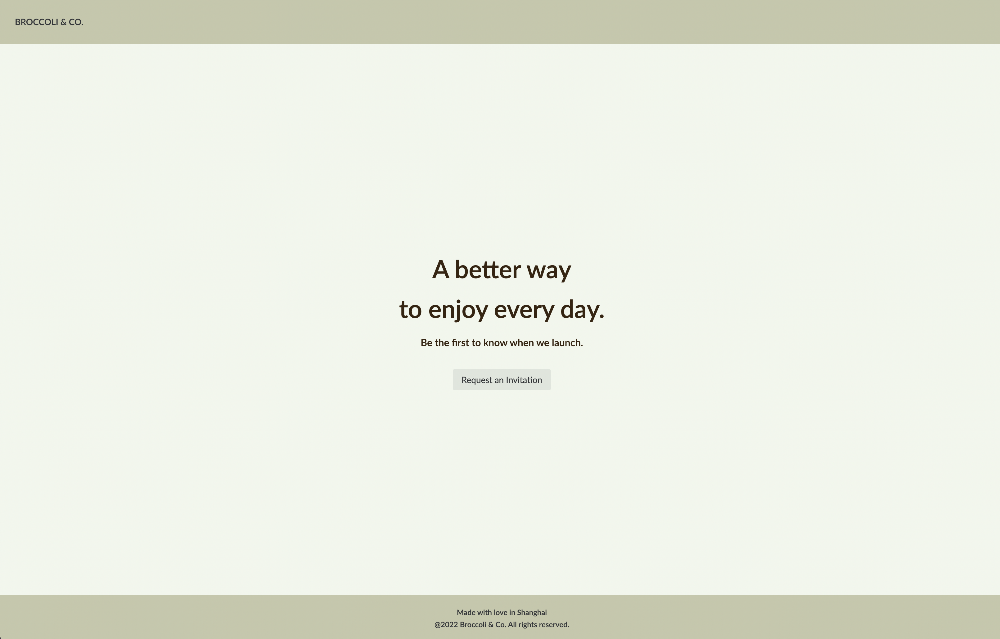
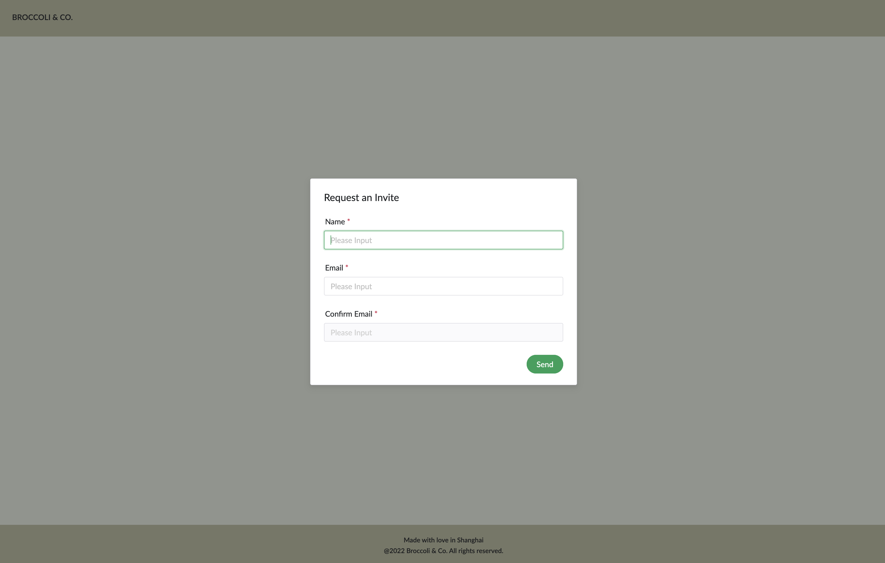
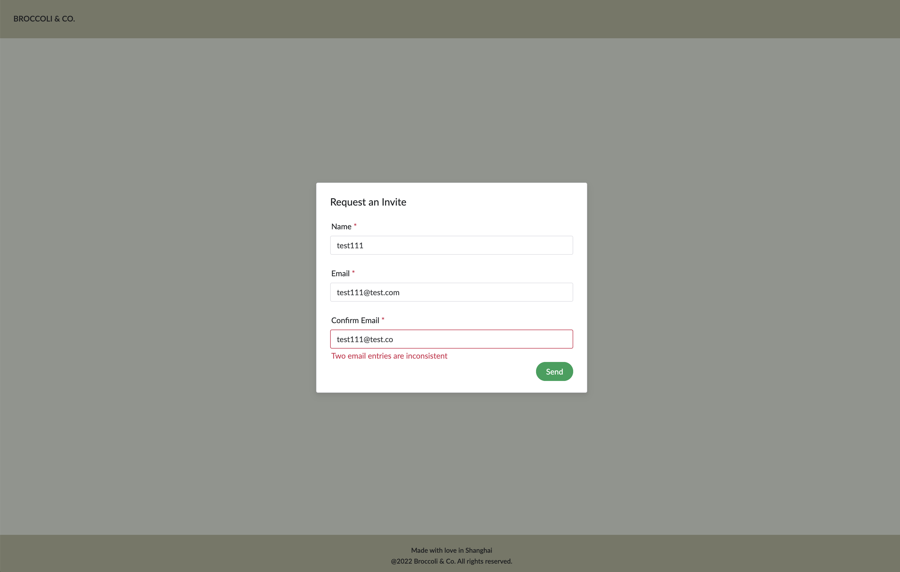
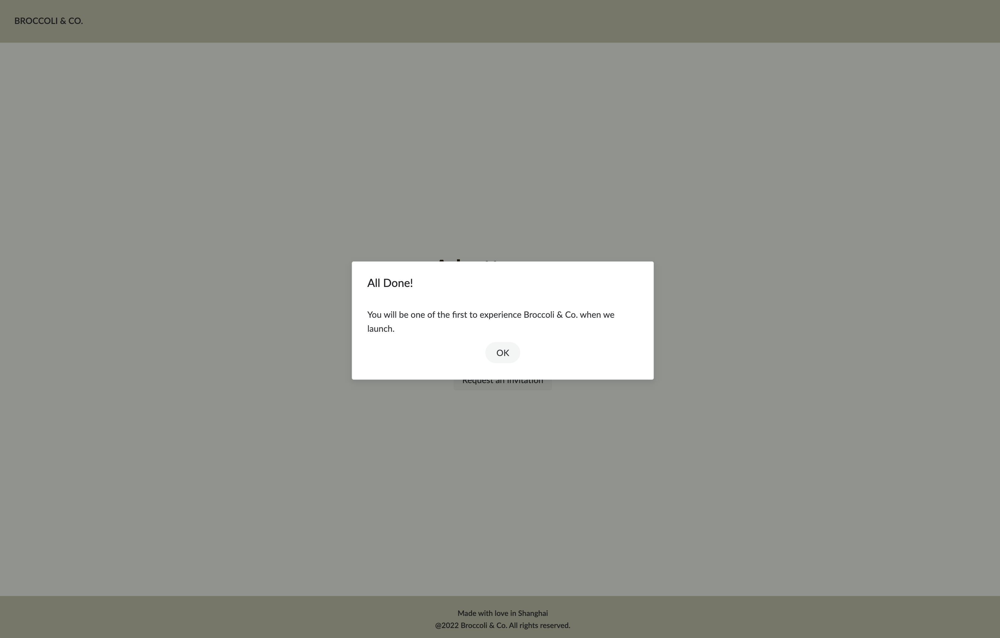
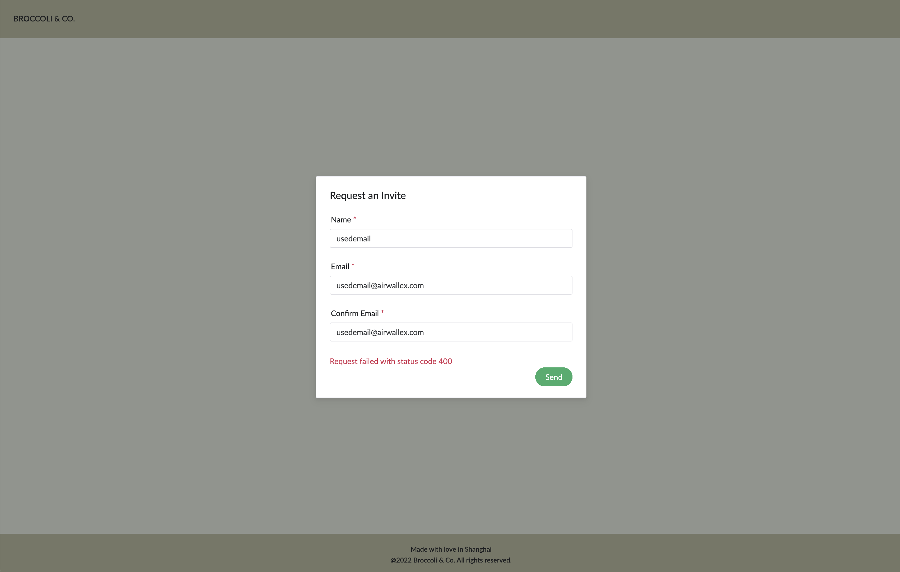
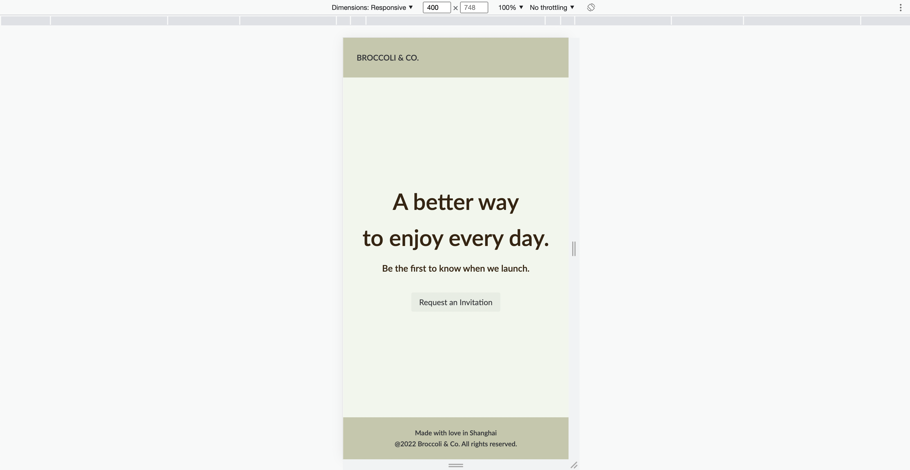
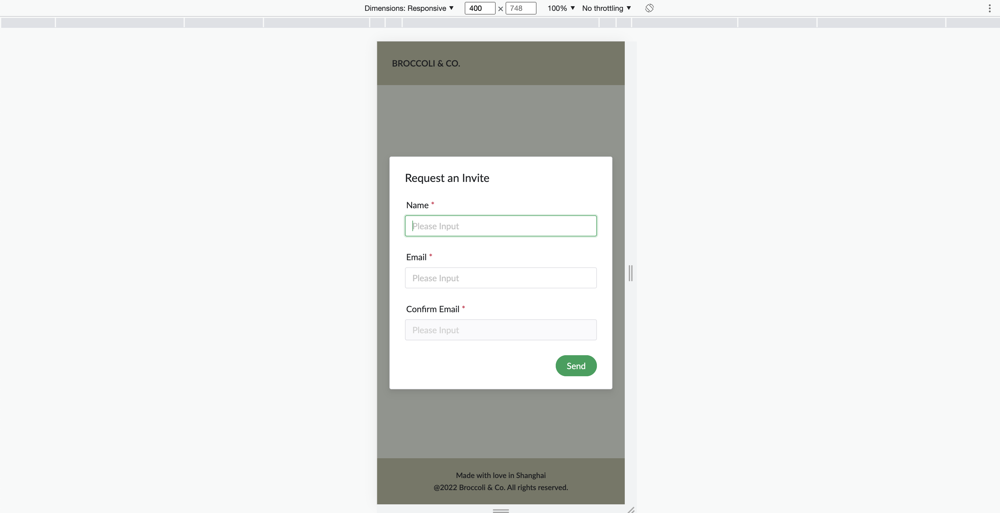

# broccoli-invitation-static

This is a simple single-page web application for Broccoli & Co.

## Tech Stack

[Vue3](https://vuejs.org/) + Vite + [NativeUI](https://www.naiveui.com/zh-CN/os-theme) + Axios

## Recommended IDE Setup

[VSCode](https://code.visualstudio.com/) + [Volar](https://marketplace.visualstudio.com/items?itemName=johnsoncodehk.volar) (and disable Vetur) + [TypeScript Vue Plugin (Volar)](https://marketplace.visualstudio.com/items?itemName=johnsoncodehk.vscode-typescript-vue-plugin).

## Project Setup

```sh
npm install
```

### Compile and Hot-Reload for Development

```sh
npm run dev
```

### Type-Check, Compile and Minify for Production

```sh
npm run build
```

### Run Unit Tests with [Vitest](https://vitest.dev/)

```sh
npm run test:unit
```

## Page Overview

### HomePage



### Get Invitation



### Validate Failed



### Request Succeed



### Request Failed



### Mobile View



